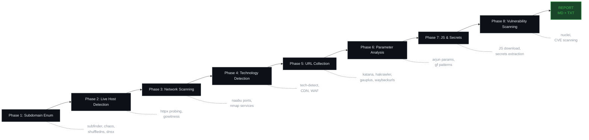

<div align="center">


<br>

[](https://python.org)
[](https://github.com/Mohamed-AlienX/ReconX-Framework/actions)
[](https://github.com/Mohamed-AlienX/ReconX-Framework)
[](LICENSE)
[]()

</div>

---

## Table of Contents

- [Overview](#overview)
- [Features](#features)
- [Architecture](#architecture)
- [Installation](#installation)
- [Usage](#usage)
- [Phase Breakdown](#phase-breakdown)
- [Tool Reference](#tool-reference)
- [Configuration](#configuration)
- [Development](#development)
- [Output Structure](#output-structure)
- [Contributing](#contributing)
- [License](#license)

---

## Overview

**ReconX Framework** is a production-grade, 8-phase automated reconnaissance pipeline designed for bug bounty hunters, penetration testers, and security engineers. It orchestrates 25+ industry-standard security tools into a single, cohesive workflow -- from passive subdomain discovery to critical vulnerability detection.

Built with a **"broad -> filter -> deep"** philosophy, ReconX minimizes false positives and produces actionable intelligence at every stage.

> **One command. Eight phases. Zero manual stitching.**

---

## Features

| Feature | Description |
|---------|-------------|
| **8-Phase Pipeline** | Complete recon workflow from subdomains to vulnerability findings |
| **Smart Filtering** | Noise reduction, deduplication, and priority scoring built-in |
| **Dual Mode** | `stealth` (low footprint) or `aggressive` (maximum coverage) |
| **Rich Reporting** | Markdown + text summaries with statistics and next-step guidance |
| **Tool Doctor** | Built-in `--check` to verify all dependencies |
| **Auto-Update** | One-command tool updates with `--update` |
| **Resume Support** | Phase-level resume markers -- stop and restart anytime |
| **Type-Safe** | Full type hints, mypy checked, 63 passing tests |
| **Cross-Platform** | Linux, macOS, Windows (PowerShell installer) |

---

## Architecture



---

## Installation

### Prerequisites

- Python 3.10+
- Go 1.21+
- `git`

### Linux / macOS

```bash
git clone https://github.com/Mohamed-AlienX/ReconX-Framework.git
cd ReconX-Framework

chmod +x install.sh
./install.sh

pip3 install -r requirements.txt
python3 recon.py --check
```

### Windows (PowerShell)

```powershell
git clone https://github.com/Mohamed-AlienX/ReconX-Framework.git
cd ReconX-Framework

.\install.ps1
pip install -r requirements.txt
python recon.py --check
```

### As a Python Package

```bash
pip install -e ".[dev]"

# Run via CLI entry point
reconx example.com

# Or via module
python -m recon example.com
```

---

## Usage

### Basic Usage

```bash
# Stealth mode (default)
python3 recon.py example.com

# Aggressive mode
python3 recon.py example.com aggressive

# Quiet mode (minimal output)
python3 recon.py example.com --quiet

# Verbose mode
python3 recon.py example.com -vv
```

### Interactive Mode

```bash
python3 recon.py
# [?] Enter target: example.com
# [?] Stealth or aggressive? (s/a): s
```

### Utility Commands

```bash
python3 recon.py --check    # Check all tool dependencies
python3 recon.py --update   # Update all tools + nuclei templates
```

---

## Phase Breakdown

### Phase 1: Subdomain Enumeration
- **Passive:** `subfinder`, `chaos`
- **Bruteforce:** `shuffledns` + wordlist
- **Validation:** `dnsx` (A + CNAME records)
- **Takeover:** `subzy`, `nuclei` (takeover tags)

### Phase 2: Live Host Detection
- **Probing:** `httpx` (status codes, redirects)
- **Screenshots:** `gowitness` (optional)

### Phase 3: Network Scanning
- **Port Scanning:** `naabu` (all ports) + `nmap` (service detection)
- **Vuln Scanning:** `nuclei` (network + web)
- **Prioritization:** P1/P2 manual target list generation

### Phase 4: Technology Detection
- **Fingerprinting:** `httpx` (tech-detect, CDN, server)
- **Categorization:** CMS, frameworks, JS frameworks, cloud/CDN/WAF

### Phase 5: URL Collection
- **Crawlers:** `katana`, `hakrawler`
- **Archives:** `gauplus`, `waybackurls`
- **JS Extraction:** `subjs`
- **Deduplication:** `uro`

### Phase 6: Parameter Analysis
- **Extraction:** From URLs + JS files
- **Discovery:** `arjun` (hidden params)
- **Pattern Matching:** `gf` (XSS, SQLi, SSRF, SSTI, LFI, etc.)

### Phase 7: JavaScript & Secrets Analysis
- **Collection:** `subjs` + URL filtering
- **Download & Beautify:** `requests`/`curl` + `js-beautify`
- **Secret Detection:** AWS keys, GitHub tokens, JWTs, API keys

### Phase 8: Vulnerability Scanning
- **Nuclei:** High + critical severity
- **CVE Focus:** Critical CVE templates only

---

## Configuration

### Mode Config

| Mode | Threads | Katana Depth | Rate Limit |
|------|---------|--------------|------------|
| `stealth` | 7 | 7 | 20 req/s |
| `aggressive` | 20 | 15 | 30 req/s |

---

## Development

### Running Tests

```bash
pip install -e ".[dev]"

# Run all tests
pytest tests/ -v

# Run with coverage
pytest tests/ -v --cov=recon --cov-report=term-missing

# Specific test categories
pytest tests/ -v -k "test_recon_logger"    # Logger tests
pytest tests/ -v -k "test_phase_runner"    # PhaseRunner tests
pytest tests/ -v -k "test_pipeline"        # Pipeline tests
```

### Code Quality

```bash
ruff check recon.py          # Lint
ruff format --check recon.py # Format check
mypy recon.py --ignore-missing-imports  # Type check
```

### Pre-commit Hooks

```bash
pip install pre-commit
pre-commit install

# Run manually
pre-commit run --all-files
```

### CI Pipeline

Every push and PR runs:
1. **Lint** -- ruff check + format check + mypy
2. **Test** -- pytest with coverage across Python 3.10-3.13
3. **Syntax** -- verify `python -m recon --help` works

---

## Output Structure

```
recon_example.com_20250619_143022/
+-- subdomains/           # Validated subdomains
+-- live_hosts/           # Probed live URLs
+-- network/              # Open ports, nmap scans, manual targets
+-- technology/           # CMS, frameworks, servers, CDN/WAF
+-- content/              # Crawled URLs (all + 200 only)
+-- parameters/           # Discovered parameters + GF patterns
+-- javascript/           # JS URLs, endpoints, secrets, beautified
+-- vulnerabilities/      # Nuclei findings, critical CVEs
+-- screenshots/          # gowitness screenshots
+-- logs/                 # Full logs, per-tool logs, per-phase logs
+-- REPORT.md             # Markdown report
+-- SUMMARY.txt           # Text summary
+-- .phase_*_done         # Resume markers
```

---

## License

This project is licensed under the **MIT License** -- see the [LICENSE](LICENSE) file for details.

---

## Acknowledgments

- [ProjectDiscovery](https://github.com/projectdiscovery) for the incredible open-source security tool suite
- [SecLists](https://github.com/danielmiessler/SecLists) for wordlists
- The bug bounty and security community for continuous inspiration

---

<div align="center">

**Made with care by [Mohamed Abd almalek](https://github.com/YOUR_USERNAME)**

</div>
